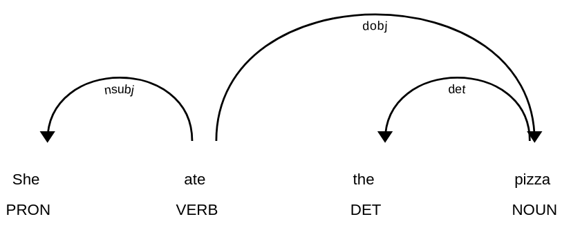

# spacy-example-medium-article
This repository walks you through finding syntactic dependencies and named entities in text using spacy. It is meant to be a supplement to the related medium article: https://medium.com/red-buffer/semantic-analysis-using-python-296639d082aa

